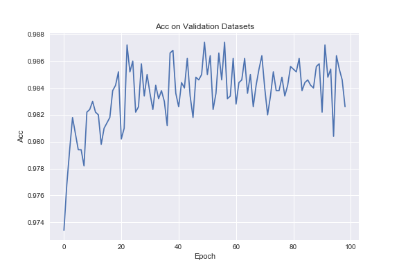
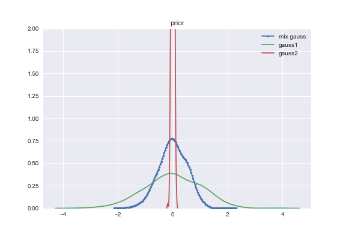
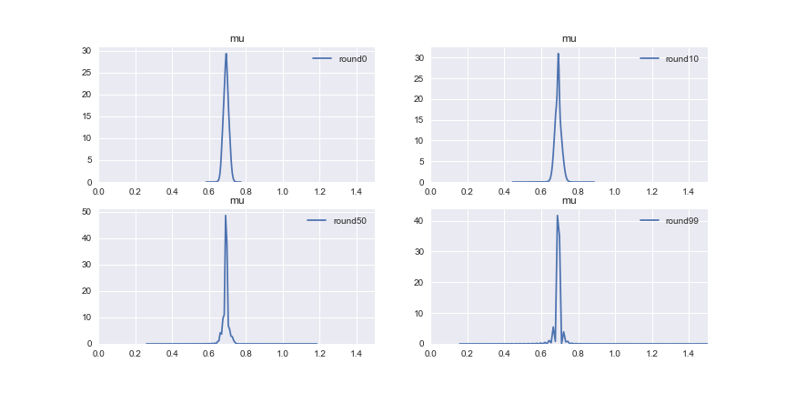
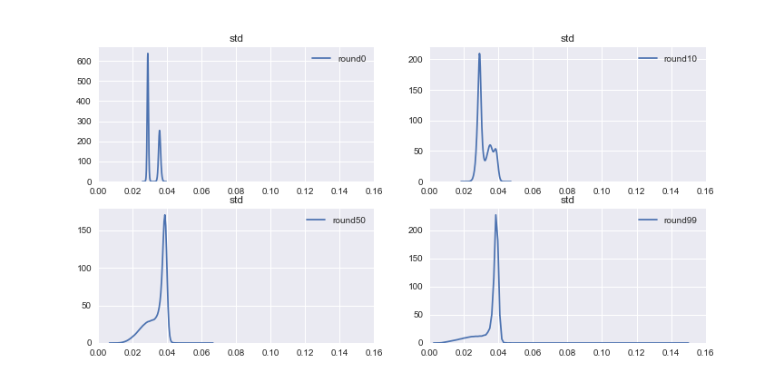

## Weight Uncertainty in Neural Networks


This is a TensorFlow implementation of [Weight Uncertainty in Neural Networks](https://arxiv.org/abs/1505.05424).

## Acc on Validation Datasets 




## Gaussian Mixture Prior



## Gaussian Variational Posterior






**Above results are obtained by Adam Optimizer.**

## How to run

```
python main.py --model 1 --train 
```


Model configuration are in ``model/default.py``

The difference between ``Model1`` and ``Model2`` is that

- Each optimization step, there are several sample steps for ``Model1``, while there is only one sample step for ``Model2``.

- ``Model2`` achieves parallel weight computation while ``Model1`` uses serial weight computation. (But it turns out  ``Model1`` is fast!)


